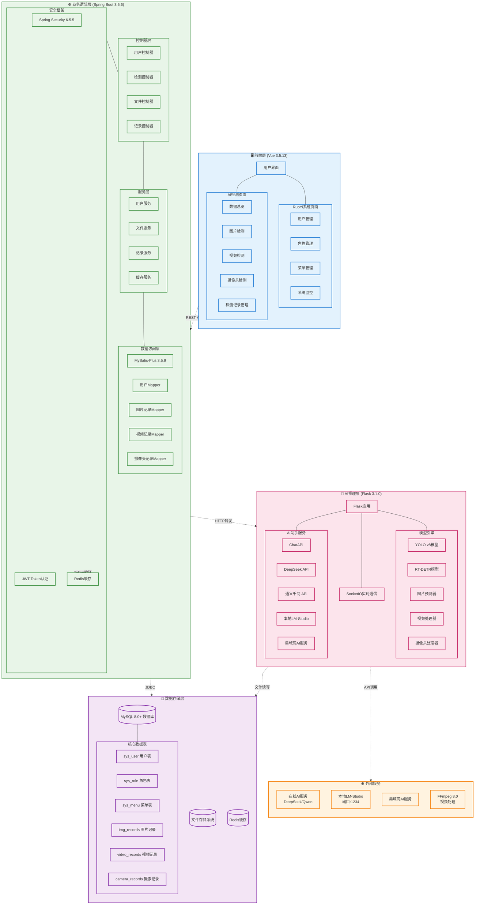
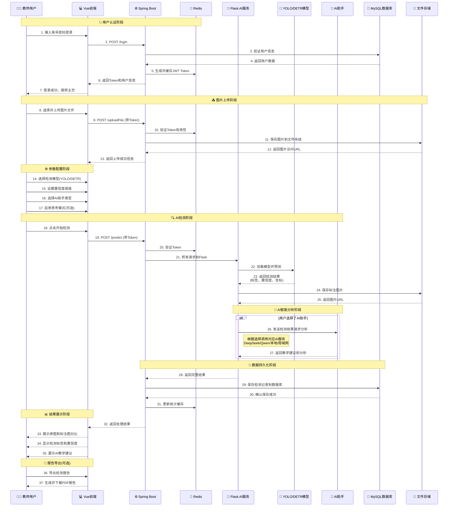
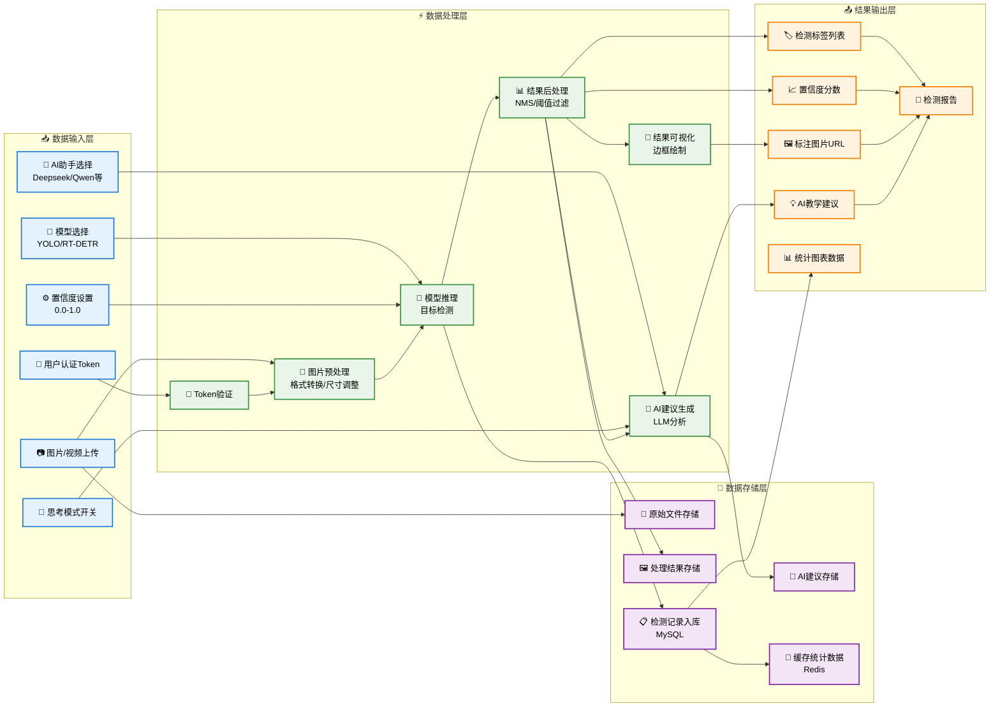
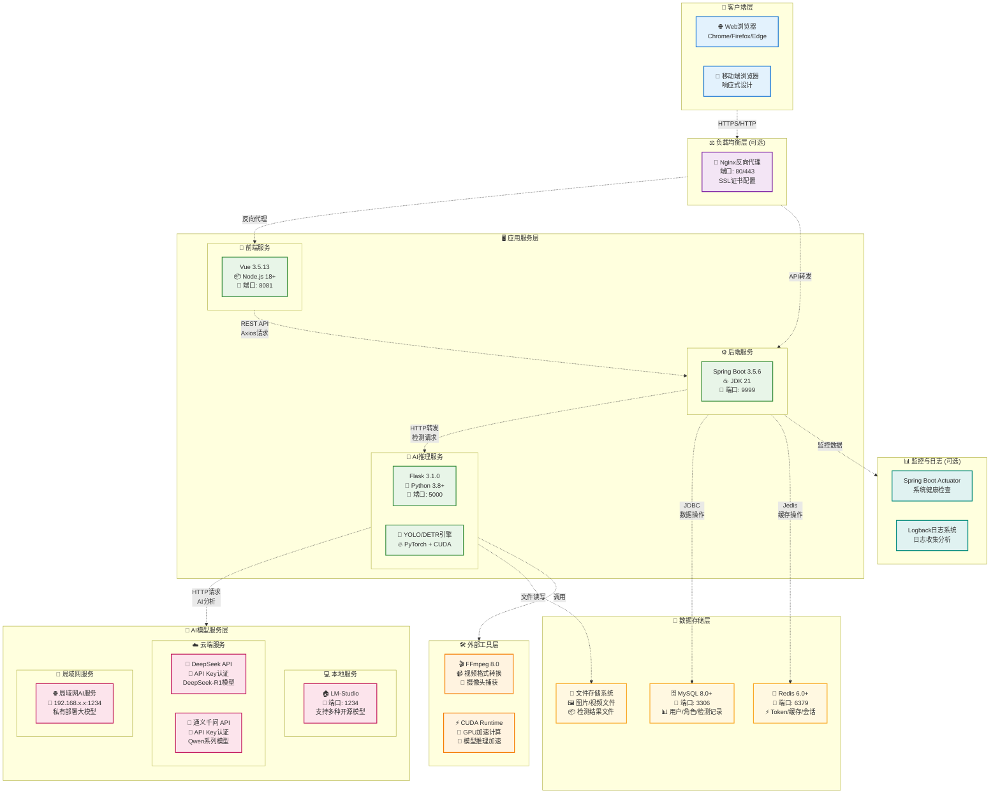

# 🎓 RuoYi-AI-Classroom

## 基于RuoYi框架的智能课堂行为分析系统

[](https://opensource.org/licenses/MIT)
[](https://openjdk.java.net/)
[](https://spring.io/projects/spring-boot)
[](https://vuejs.org/)
[](https://www.python.org/)
[](http://ruoyi.vip/)

---

## 📋 目录

- [📖 项目简介](#-项目简介)
- [💻 技术栈](#-技术栈)
- [🏗️ 系统架构](#️-系统架构)
  - [📋 架构概览](#-架构概览)
  - [🔧 核心组件说明](#-核心组件说明)
  - [📁 项目目录结构](#-项目目录结构)
- [🔄 系统流程设计](#-系统流程设计)
  - [⏱️ 图片检测流程时序图](#️-图片检测流程时序图)
  - [📊 数据流图](#-数据流图)
- [🗄️ 数据模型设计](#️-数据模型设计)
  - [📊 实体关系图](#-实体关系图)
- [🚀 部署架构](#-部署架构)
  - [🖥️ 部署架构图](#️-部署架构图)
  - [🌐 网络拓扑说明](#-网络拓扑说明)
- [🚀 快速开始](#-快速开始)
- [🎯 主要功能](#-主要功能)
- [🔑 默认账号](#-默认账号)
- [📡 API接口](#-api接口)
- [🔧 配置说明](#-配置说明)
- [🐛 常见问题](#-常见问题)
- [🎨 界面预览](#-界面预览)
- [🚀 部署建议](#-部署建议)
- [📝 更新日志](#-更新日志)
- [🤝 贡献指南](#-贡献指南)
- [🙏 致谢](#-致谢)

---

## 📖 项目简介

> **本项目是基于原"计算机图像检测与大模型反馈的课堂行为系统"深度改装而来**，完整集成了 **RuoYi-Vue3** 前后端分离框架，升级至 **Spring Boot 3.5.6** 和 **Vue 3** 最新版本。

系统结合 **计算机视觉（YOLO/RT-DETR）** 与 **大语言模型（Deepseek/通义千问）**，在 RuoYi 企业级框架基础上，实现课堂行为自动识别、智能分析与反馈。

### 🌟 核心特性

- 🏢 **企业级RuoYi框架**：完善的权限管理、菜单配置、系统监控
- 🤖 **AI智能检测**：YOLO/RT-DETR目标检测 + 大模型智能分析
- 🎯 **前后端分离**：Spring Boot 3.5.6 + Vue 3 + Element Plus
- 📊 **数据可视化**：ECharts实时展示学生行为统计
- 🔐 **安全认证**：Spring Security + JWT + Redis
- 📹 **多模态检测**：图片、视频、实时摄像头三种检测方式

### ✨ 项目亮点

| 特性 | 说明 |
|------|------|
| 🎯 高精度检测 | 基于YOLOv8和RT-DETR先进算法，识别9种课堂行为，准确率高 |
| 🧠 智能AI分析 | 集成DeepSeek、通义千问等大模型，提供专业教学建议 |
| ⚡ 实时处理 | WebSocket实时推送检测进度，毫秒级响应 |
| 🔧 灵活部署 | 支持云端API、本地LM-Studio、局域网三种AI部署方式 |
| 📊 可视化报告 | 直观的检测结果展示，支持PDF报告导出 |
| 🚀 现代技术栈 | Spring Boot 3.5.6 + Vue 3.5.13，性能卓越 |
| 🎨 美观界面 | Element Plus现代化UI，交互流畅 |
| 🔐 企业级安全 | Spring Security + JWT双重认证，数据安全可靠 |

---

## 💻 技术栈

### 后端技术

| 技术 | 版本 | 说明 |
|------|------|------|
| Spring Boot | 3.5.6 | 核心框架 |
| Spring Security | 6.5.5 | 安全框架 |
| MyBatis-Plus | 3.5.9 | ORM框架 |
| MySQL | 8.0+ | 关系型数据库 |
| Redis | Latest | 缓存 |
| Druid | 1.2.23 | 数据库连接池 |
| JWT | 0.9.1 | Token认证 |
| Quartz | 2.5.0 | 定时任务 |
| Flask | 3.1.0 | AI推理服务 |

### 前端技术

| 技术 | 版本 | 说明 |
|------|------|------|
| Vue.js | 3.5.13 | 渐进式框架 |
| Element Plus | Latest | UI组件库 |
| Vite | Latest | 构建工具 |
| Axios | 1.7.9 | HTTP客户端 |
| Pinia | Latest | 状态管理 |
| ECharts | Latest | 数据可视化 |
| Socket.IO | Latest | 实时通信 |

### AI推理

| 技术 | 版本 | 说明 |
|------|------|------|
| Ultralytics | 8.3.53 | YOLO框架 |
| OpenCV | 4.10.0 | 计算机视觉 |
| FFmpeg | 8.0 | 视频处理 |
| Flask-SocketIO | 5.4.1 | WebSocket |

---

## 🏗️ 系统架构

### 📋 架构概览

本项目采用现代化的微服务架构设计，基于RuoYi-Vue3框架，集成AI检测与大模型分析能力。



### 🔧 核心组件说明

1. **🖥️ 前端层 (Vue 3 + Element Plus)**
   - **RuoYi系统页面**：完整的权限管理、用户管理、系统监控等企业级功能
   - **AI检测页面**：图片/视频/摄像头检测、数据可视化、检测记录管理

2. **⚙️ 业务逻辑层 (Spring Boot 3.5.6)**
   - **安全框架**：Spring Security + JWT + Redis实现完整的认证授权体系
   - **分层架构**：Controller → Service → Mapper 清晰的三层架构
   - **MyBatis-Plus**：简化数据库操作，提供强大的CRUD能力

3. **🤖 AI推理层 (Flask + PyTorch)**
   - **模型引擎**：支持YOLO v8和RT-DETR两种检测模型
   - **AI助手**：集成多种大语言模型提供智能分析
   - **实时通信**：SocketIO支持实时检测进度推送

4. **💾 数据存储层**
   - **MySQL**：存储用户数据、检测记录、系统配置
   - **Redis**：缓存用户会话、Token、频繁访问数据
   - **文件存储**：保存上传的图片、视频及检测结果

### 📁 项目目录结构

```
RuoYi-Vue3-springboot3/
├── ruoyi-admin/          # Spring Boot主应用
├── ruoyi-system/         # 系统核心模块
├── ruoyi-common/         # 公共工具类
├── ruoyi-framework/      # 框架核心（Security配置）
├── ruoyi-quartz/         # 定时任务模块
├── ruoyi-generator/      # 代码生成器
├── ruoyi-flask/          # Flask AI推理服务
│   ├── main(DETR).py     # RT-DETR检测服务
│   ├── main(YOLO).py     # YOLO检测服务
│   ├── utils/            # 工具类（chatApi.py等）
│   └── weights/          # 模型权重文件
├── ruoyi-ui/             # Vue3前端项目
│   ├── src/
│   │   ├── views/ai/     # AI检测页面
│   │   │   ├── data-overview/     # 数据总览
│   │   │   ├── img-predict/       # 图片检测
│   │   │   ├── video-predict/     # 视频检测
│   │   │   ├── camera-predict/    # 摄像头检测
│   │   │   ├── img-records/       # 图片记录
│   │   │   ├── video-records/     # 视频记录
│   │   │   └── camera-records/    # 摄像记录
│   │   └── ...
│   └── package.json
├── sql/                  # 数据库脚本
│   ├── ry_20250522.sql   # RuoYi基础表结构
│   ├── quartz.sql        # Quartz定时任务表
│   └── ai-detection-menus.sql  # AI检测菜单和权限
├── ffmpeg-8.0-full_build/  # FFmpeg工具（视频处理）
└── pom.xml               # Maven父项目配置
```

---

## 🔄 系统流程设计

### ⏱️ 图片检测流程时序图



### 📊 数据流图



---

## 🗄️ 数据模型设计

### 📊 实体关系图


---

## 🚀 部署架构

### 🖥️ 部署架构图



### 🌐 网络拓扑说明

1. **客户端访问**：用户通过浏览器访问系统（可选配置Nginx进行负载均衡和SSL加密）
2. **前后端分离**：Vue前端（8081端口）与Spring Boot后端（9999端口）独立部署
3. **AI服务独立**：Flask AI服务（5000端口）作为独立微服务运行
4. **数据库集群**：MySQL存储持久化数据，Redis提供高速缓存
5. **AI模型灵活部署**：支持云端API、本地LM-Studio、局域网私有部署三种方式
6. **监控体系**：Spring Boot Actuator提供健康检查，Logback记录系统日志

---

## 🚀 快速开始

### 📋 环境要求

| 软件 | 版本 | 必需 |
|------|------|------|
| JDK | 21+ | ✅ |
| Node.js | 18+ | ✅ |
| Python | 3.8+ | ✅ |
| MySQL | 8.0+ | ✅ |
| Redis | 6.0+ | ✅ |
| Maven | 3.6+ | ✅ |

### 1️⃣ 数据库初始化

```sql
-- 1. 创建数据库
CREATE DATABASE ry_vue CHARACTER SET utf8mb4 COLLATE utf8mb4_unicode_ci;

-- 2. 导入RuoYi基础表结构（约24张表）
source sql/ry_20250522.sql;

-- 3. 导入Quartz定时任务表
source sql/quartz.sql;

-- 4. 初始化AI检测菜单和权限
source sql/ai-detection-menus.sql;
```

### 2️⃣ 后端配置

修改 `ruoyi-admin/src/main/resources/application-druid.yml`：

```yaml
spring:
  datasource:
    druid:
      master:
        url: jdbc:mysql://localhost:3306/ry_vue?useUnicode=true&characterEncoding=utf8&zeroDateTimeBehavior=convertToNull&useSSL=true&serverTimezone=GMT%2B8
        username: root        # 修改数据库用户名
        password: password    # 修改数据库密码
```

修改 `application.yml`（Redis配置）：

```yaml
spring:
  data:
    redis:
      host: localhost
      port: 6379
      password:              # Redis密码（如有）
      database: 0
```

### 3️⃣ IntelliJ IDEA 配置（重要）

如果使用 **IntelliJ IDEA** 开发，请按以下步骤配置（解决 JDK 25 编译问题）：

1. 打开 `File` → `Settings`（或按 `Ctrl + Alt + S`）
2. 导航到：`Build, Execution, Deployment` → `Build Tools` → `Maven` → `Runner`
3. 勾选 ✅ **`Delegate IDE build/run actions to Maven`**（将 IDE 构建/运行操作委托给 Maven）
4. 点击 `Apply` 和 `OK`
5. 重新构建项目：`Build` → `Rebuild Project`

> 💡 **说明**：此配置让 IDEA 使用 Maven 进行编译，而不是自带的编译器。Maven 会自动应用 `pom.xml` 中配置的 JDK 25 兼容性参数，避免编译错误。

### 4️⃣ 启动后端服务

```bash
# 编译整个项目
mvn clean install

# 启动主应用
cd ruoyi-admin
mvn spring-boot:run

# 或在 IDEA 中直接运行 RuoYiApplication.java
```

访问：http://localhost:9999

### 5️⃣ Python环境配置

```bash
# 创建虚拟环境（推荐）
conda create -n yolo python=3.8
conda activate yolo

# 安装依赖
cd ruoyi-flask
pip install flask flask-socketio flask-cors
pip install ultralytics opencv-python numpy
pip install requests openai python-dotenv
```

### 6️⃣ 启动Flask AI服务

```bash
cd ruoyi-flask

# 启动RT-DETR服务
python main(DETR).py

# 或启动YOLO服务（二选一）
python main(YOLO).py
```

访问：http://localhost:5000

### 7️⃣ 前端配置与启动

```bash
cd ruoyi-ui

# 安装依赖
npm install
# 或 yarn install
# 或 pnpm install

# 启动开发服务器
npm run dev

# 生产环境打包
npm run build:prod
```

访问：http://localhost:8081

---

## 🎯 主要功能

### 📊 数据总览（新增）
- 学生行为统计图（柱状图）
- 用户使用率分析（饼图）
- 近期检测情况（表格）

### 🖼️ AI检测模块
- **图片检测**：单张图片上传检测
- **视频检测**：视频文件批量处理
- **摄像头检测**：实时流媒体处理

### 📝 检测记录管理
- **图片记录**：查看、修改、删除、导出
- **视频记录**：在线播放、记录管理
- **摄像记录**：完整录制过程管理
- **批量操作**：支持批量删除

### 🛠️ RuoYi系统功能
- 用户管理、角色管理、菜单管理
- 部门管理、岗位管理、字典管理
- 参数设置、通知公告、日志管理
- 定时任务、系统监控、代码生成

### 🤖 AI助手支持
- **Deepseek**：在线API / 本地部署 / 局域网部署
- **通义千问（Qwen）**：在线API / 本地qwen3-4b / 局域网部署
- **本地LLM**：支持LM-Studio等本地大模型

### 🎓 课堂行为识别（9种）
| 行为 | 标签 |
|------|------|
| 写作 | Writing |
| 阅读 | Reading |
| 听讲 | Listening |
| 睡觉 | Sleeping |
| 讨论 | Discussing |
| 举手 | Raising_hand |
| 低头 | Bowing |
| 玩手机 | Phone |
| 站立 | Stand |

---

## 🔑 默认账号

| 账号 | 密码 | 角色 |
|------|------|------|
| admin | admin123 | 超级管理员 |
| ry | admin123 | 普通用户 |

---

## 📡 API接口

### 后端API（Spring Boot）
- **文件上传**：`POST /uploadFile`
- **预测转发**：`POST /predict`
- **图片记录**：`/imgRecords/*`
- **视频记录**：`/videoRecords/*`
- **摄像记录**：`/cameraRecords/*`

### Flask AI API
- **图片检测**：`POST /predictImg`
- **视频检测**：`POST /predictVideo`
- **摄像头检测**：`GET /predictCamera`
- **停止录制**：`GET /stopCamera`
- **模型列表**：`GET /file_names`

### Swagger文档
访问：http://localhost:9999/doc.html

---

## 🔧 配置说明

### AI模型配置

在 `ruoyi-flask/utils/chatApi.py` 中配置：

```python
# Deepseek API Key
DEEPSEEK_API_KEY = "your_deepseek_api_key"

# 通义千问 API Key  
QWEN_API_KEY = "your_qwen_api_key"

# 本地LM-Studio地址
LOCAL_API_BASE = "http://localhost:1234/v1"

# 局域网服务器地址
LAN_API_BASE = "http://192.168.1.100:1234/v1"
```

### 模型权重文件

将YOLO/RT-DETR模型文件（`.pt`）放到 `ruoyi-flask/weights/` 目录：

```
weights/
└── RT-DETR.pt    # 推荐使用RT-DETR
```

### FFmpeg路径

项目已内置FFmpeg（相对路径）：
```
RuoYi-Vue3-springboot3/ffmpeg-8.0-full_build/bin/ffmpeg.exe
```

---

## 🐛 常见问题

### Q: IntelliJ IDEA 编译失败，提示 `java.lang.ExceptionInInitializerError`？
**A:** 这是因为 IDEA 使用自带编译器无法正确处理 JDK 25。请按以下步骤解决：
1. 打开 `Settings` → `Build Tools` → `Maven` → `Runner`
2. 勾选 ✅ `Delegate IDE build/run actions to Maven`
3. 重新构建项目

或者，在 `Settings` → `Compiler` → `Java Compiler` → `Additional command line parameters` 中添加：
```
--add-exports=jdk.compiler/com.sun.tools.javac.api=ALL-UNNAMED --add-exports=jdk.compiler/com.sun.tools.javac.file=ALL-UNNAMED --add-exports=jdk.compiler/com.sun.tools.javac.main=ALL-UNNAMED --add-exports=jdk.compiler/com.sun.tools.javac.model=ALL-UNNAMED --add-exports=jdk.compiler/com.sun.tools.javac.parser=ALL-UNNAMED --add-exports=jdk.compiler/com.sun.tools.javac.processing=ALL-UNNAMED --add-exports=jdk.compiler/com.sun.tools.javac.tree=ALL-UNNAMED --add-exports=jdk.compiler/com.sun.tools.javac.util=ALL-UNNAMED --add-opens=jdk.compiler/com.sun.tools.javac.code=ALL-UNNAMED --add-opens=jdk.compiler/com.sun.tools.javac.comp=ALL-UNNAMED
```

### Q: 摄像头无法打开？
**A:** 本项目使用FFmpeg直接捕获摄像头，解决了OpenCV在Windows 11上的兼容性问题。系统会自动检测可用摄像头。

### Q: 视频转换失败？
**A:** 确保FFmpeg路径正确，项目已内置FFmpeg，使用相对路径自动查找。

### Q: AI超时？
**A:** 已将前端超时时间设置为5分钟（300秒），如仍超时，请检查：
- AI服务是否启动（Flask）
- API Key是否配置正确
- 网络连接是否正常

### Q: 检测结果显示乱码？
**A:** 已修复Unicode转义字符问题，刷新页面即可正确显示中文标签。

### Q: 批量删除失败？
**A:** 已修复批量删除功能，后端支持逗号分隔的ID列表。

---

## 🎨 界面预览

### 数据总览
- 学生行为柱状图（今日统计）
- 用户使用饼图
- 近期检测记录表格

### AI检测
- 实时显示检测进度
- 可视化检测结果
- AI智能建议

### 检测记录
- 表格展示所有记录
- 详情弹窗查看
- 批量操作支持

---

## 🚀 部署建议

### 开发环境
- 后端：IDEA 直接运行 `RuoYiApplication`
- Flask：命令行运行 `python main(DETR).py`
- 前端：`npm run dev`

### 生产环境
- 后端：`mvn clean package` 打包为jar，`java -jar` 运行
- Flask：使用 `gunicorn` 或 `uwsgi` 部署
- 前端：`npm run build:prod` 打包，使用Nginx部署

### Nginx配置示例

```nginx
server {
    listen 80;
    server_name your-domain.com;

    # 前端静态资源
    location / {
        root /path/to/ruoyi-ui/dist;
        try_files $uri $uri/ /index.html;
    }

    # 后端API
    location /prod-api/ {
        proxy_pass http://localhost:9999/;
    }

    # Flask AI服务
    location /flask/ {
        proxy_pass http://localhost:5000/;
    }
}
```

---

## 📝 更新日志

### v2.0.0 (2025-10-17) - RuoYi集成版

#### 🎉 重大更新
- ✅ 完整集成RuoYi-Vue3框架
- ✅ 升级Spring Boot至3.5.6
- ✅ 升级Vue至3最新版
- ✅ 新增数据总览可视化页面
- ✅ 优化检测记录管理
- ✅ FFmpeg摄像头方案
- ✅ 统一视频处理流程

#### 🔧 技术改进
- MyBatis-Plus替代MyBatis
- Spring Security + JWT认证
- Redis缓存优化
- Druid数据库监控

#### 🐛 Bug修复
- 修复检测结果Unicode显示问题
- 修复摄像头无法打开问题
- 修复视频转换失败问题
- 修复批量删除功能
- 修复AI超时问题

---

## 🤝 贡献指南

欢迎提交Issue和Pull Request！

### 开发规范
- 遵循Java/Python/JavaScript编码规范
- 提交信息清晰描述更改内容
- 重要功能请更新文档
- 确保新功能通过测试


## 🙏 致谢

感谢以下开源项目：

- [RuoYi-Vue3](http://ruoyi.vip/) - 若依管理系统
- [Spring Boot](https://spring.io/) - 企业级框架
- [Vue.js](https://vuejs.org/) - 前端框架
- [Ultralytics](https://ultralytics.com/) - YOLO模型
- [Deepseek](https://www.deepseek.com/) - 大语言模型
- [通义千问](https://tongyi.aliyun.com/) - 大语言模型


<div align="center">

**如果这个项目对你有帮助，请给个⭐Star支持一下！**

Made with ❤️ by RuoYi-AI-Classroom Team

</div>
