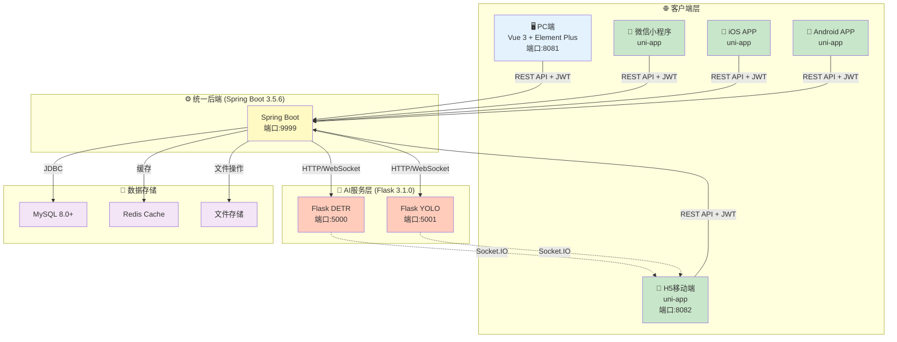
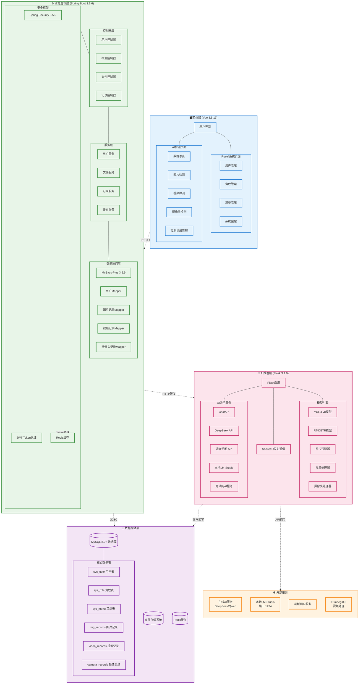
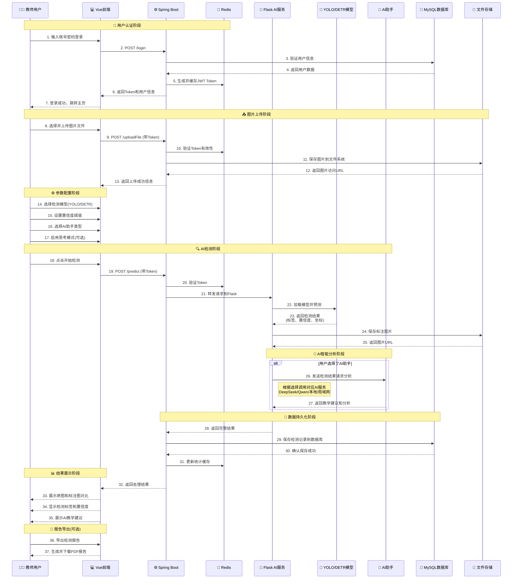
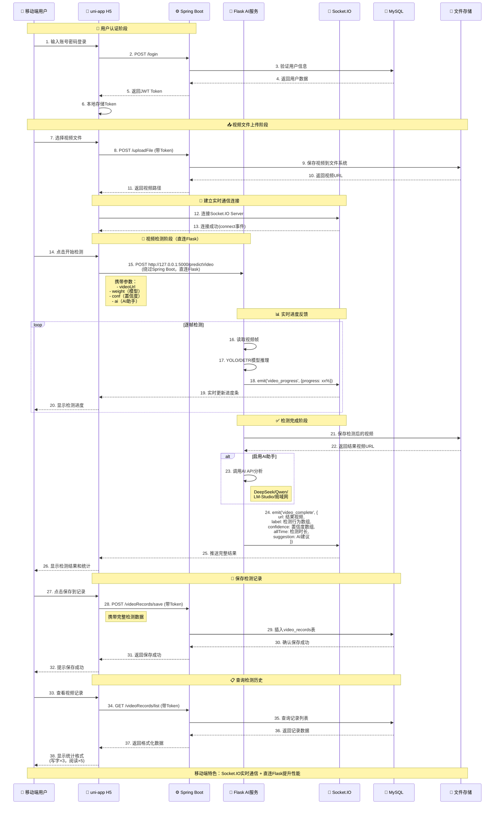
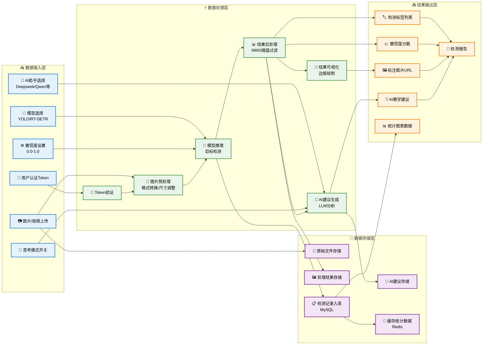
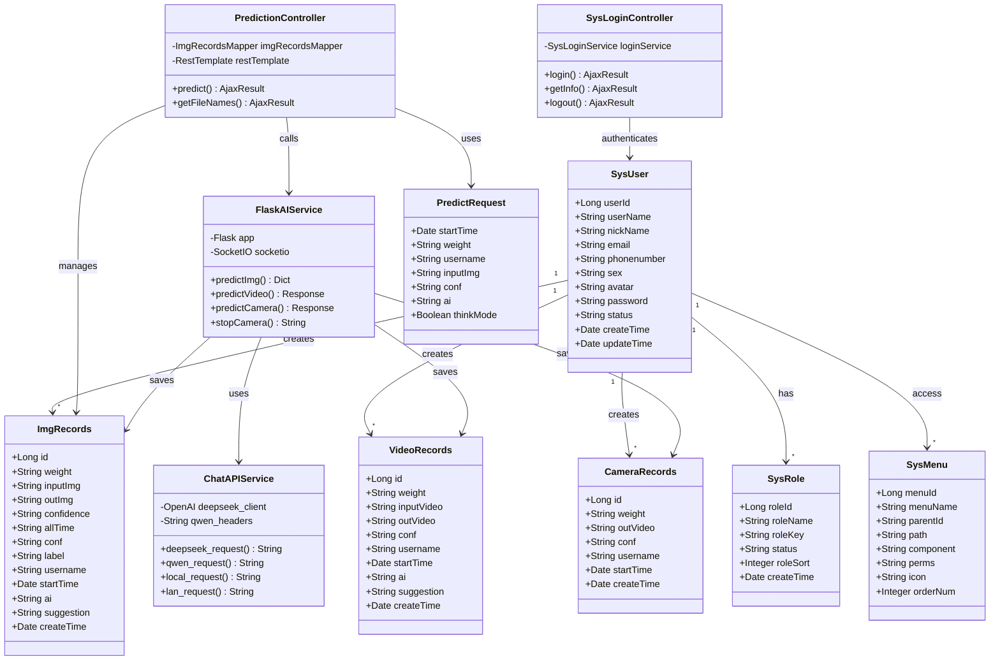
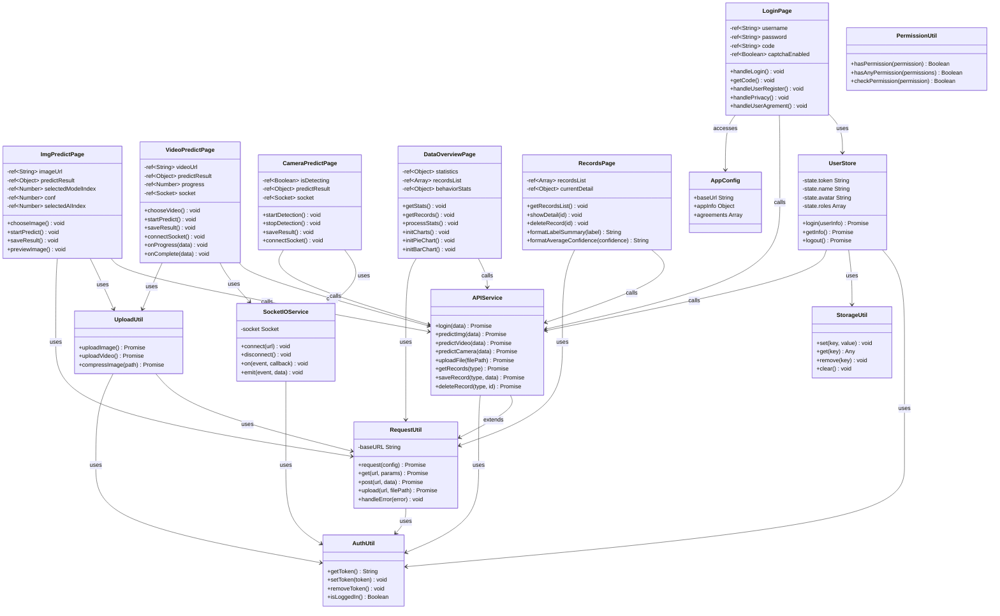
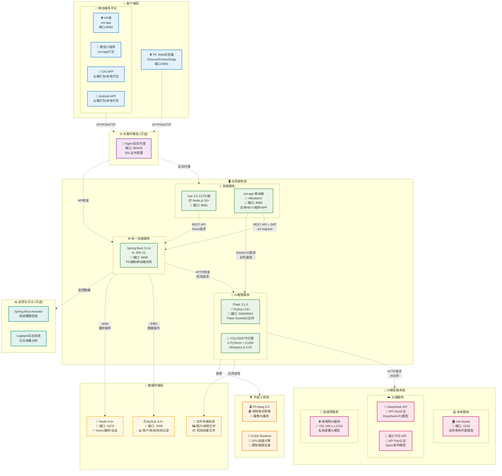

# 🎓 智能课堂行为分析系统（全栈版）

[](https://opensource.org/licenses/MIT)
[](https://openjdk.java.net/)
[](https://spring.io/projects/spring-boot)
[](https://vuejs.org/)
[](https://uniapp.dcloud.net.cn/)
[](https://www.python.org/)
[]()

---

## 📋 目录

- [📖 项目简介](#-项目简介)
- [💻 技术栈](#-技术栈)
- [🏗️ 系统架构](#️-系统架构)
  - [📋 全栈架构概览](#-全栈架构概览)
  - [🖥️ PC端架构](#️-pc端架构)
  - [📱 移动端架构](#-移动端架构)
  - [🔧 核心组件说明](#-核心组件说明)
  - [📁 项目目录结构](#-项目目录结构)
- [🔄 系统流程设计](#-系统流程设计)
  - [⏱️ PC端图片检测流程](#️-pc端图片检测流程)
  - [📱 移动端视频检测流程](#-移动端视频检测流程)
  - [📊 数据流图](#-数据流图)
- [🗄️ 数据模型设计](#️-数据模型设计)
  - [📊 实体关系图](#-实体关系图)
  - [📱 移动端类图](#-移动端类图)
- [🚀 部署架构](#-部署架构)
  - [🖥️ 部署架构图](#️-部署架构图)
  - [🌐 网络拓扑说明](#-网络拓扑说明)
- [🚀 快速开始](#-快速开始)
- [🎯 主要功能](#-主要功能)
- [🔑 默认账号](#-默认账号)
- [📡 API接口](#-api接口)
- [🔧 配置说明](#-配置说明)
- [🐛 常见问题](#-常见问题)
- [🎨 界面预览](#-界面预览)
- [🚀 部署建议](#-部署建议)
- [📝 更新日志](#-更新日志)
- [🤝 贡献指南](#-贡献指南)
- [🙏 致谢](#-致谢)

---

## 📖 项目简介

> **本项目是全栈智能课堂行为分析系统**，基于 **RuoYi-Vue3** 企业级框架深度定制，同时移植 **RuoYi-App-Vue3** 移动端框架，实现PC端 + 移动端全平台覆盖。

系统整合 **Spring Boot 3.5.6**、**Vue 3.5.13**、**uni-app** 等现代技术栈，结合 **计算机视觉（YOLO/RT-DETR）** 与 **大语言模型（DeepSeek/通义千问）**，打造企业级AI教育应用解决方案。

### 🌟 核心特性

- 🏢 **企业级框架**：基于RuoYi框架，完善的权限管理、菜单配置、系统监控
- 📱 **全平台覆盖**：PC端（Web） + 移动端（H5/小程序/APP），一套后端多端复用
- 🤖 **AI智能检测**：YOLO/RT-DETR目标检测 + 大模型智能分析
- 🎯 **前后端分离**：Spring Boot 3.5.6 + Vue 3 + Element Plus + uni-app
- 📊 **数据可视化**：ECharts实时展示学生行为统计（PC端和移动端）
- 🔐 **安全认证**：Spring Security + JWT + Redis统一认证
- 📹 **多模态检测**：图片、视频、实时摄像头三种检测方式（PC端和移动端均支持）
- 🔄 **实时通信**：WebSocket/Socket.IO实时推送检测进度

### ✨ 项目亮点

| 特性 | 说明 |
|------|------|
| 🎯 高精度检测 | 基于YOLOv8和RT-DETR先进算法，识别9种课堂行为，准确率高 |
| 🧠 智能AI分析 | 集成DeepSeek、通义千问等大模型，提供专业教学建议 |
| ⚡ 实时处理 | WebSocket/Socket.IO实时推送检测进度，毫秒级响应 |
| 📱 多端适配 | 基于uni-app，支持H5/微信小程序/APP多端发布 |
| 🔧 灵活部署 | 支持云端API、本地LM-Studio、局域网三种AI部署方式 |
| 📊 可视化报告 | ECharts数据可视化，直观展示检测统计 |
| 🚀 现代技术栈 | Spring Boot 3.5.6 + Vue 3.5.13 + uni-app，性能卓越 |
| 🎨 美观界面 | Element Plus（PC端） + uni-ui（移动端）现代化UI |
| 🔐 企业级安全 | Spring Security + JWT双重认证，PC端与移动端统一鉴权 |
| 🔄 代码复用 | 一套Spring Boot后端，同时服务PC端和移动端 |

---

## 💻 技术栈

### 后端技术

| 技术 | 版本 | 说明 |
|------|------|------|
| Spring Boot | 3.5.6 | 核心框架 |
| Spring Security | 6.5.5 | 安全框架 |
| MyBatis-Plus | 3.5.9 | ORM框架 |
| MySQL | 8.0+ | 关系型数据库 |
| Redis | Latest | 缓存 |
| Druid | 1.2.23 | 数据库连接池 |
| JWT | 0.9.1 | Token认证 |
| Quartz | 2.5.0 | 定时任务 |
| Flask | 3.1.0 | AI推理服务 |

### 前端技术（PC端）

| 技术 | 版本 | 说明 |
|------|------|------|
| Vue.js | 3.5.13 | 渐进式框架 |
| Element Plus | Latest | UI组件库 |
| Vite | Latest | 构建工具 |
| Axios | 1.7.9 | HTTP客户端 |
| Pinia | Latest | 状态管理 |
| ECharts | Latest | 数据可视化 |
| Socket.IO | 4.5.4 | 实时通信 |

### 前端技术（移动端）

| 技术 | 版本 | 说明 |
|------|------|------|
| uni-app | Vue3版 | 跨平台框架 |
| Vue.js | 3.x | 渐进式框架 |
| uni-ui | Latest | 移动端组件库 |
| Socket.IO Client | 4.5.4 | 实时通信 |
| ECharts | 5.4.3 | 数据可视化（H5） |
| HBuilderX | Latest | IDE工具 |

### AI推理

| 技术 | 版本 | 说明 |
|------|------|------|
| Ultralytics | 8.3.53 | YOLO框架 |
| OpenCV | 4.10.0 | 计算机视觉 |
| FFmpeg | 8.0 | 视频处理 |
| Flask-SocketIO | 5.4.1 | WebSocket |
| Flask-CORS | Latest | 跨域支持 |

---

## 🏗️ 系统架构

### 📋 全栈架构概览

本项目采用现代化的全栈架构设计，**PC端基于RuoYi-Vue3框架**，**移动端移植RuoYi-App-Vue3框架**，共享同一套Spring Boot后端，集成AI检测与大模型分析能力。



### 🖥️ PC端架构

PC端基于RuoYi-Vue3框架，采用Vue 3 + Element Plus构建企业级管理后台。



### 📱 移动端架构

移动端基于**RuoYi-App-Vue3**框架深度定制，采用uni-app跨平台框架，支持H5/小程序/APP多端发布。

```mermaid
graph TD
    %% 移动端前端层
    subgraph MobileFrontend["📱 移动端前端 (uni-app Vue3)"]
        direction TB
        MobileUI[移动端界面]
        
        subgraph TabBar["底部导航"]
            HomePage[🏠 首页]
            AIAnalysis[🤖 AI分析]
            Workbench[💼 工作台]
            Mine[👤 我的]
        end
        
        subgraph AIFeatures["AI检测功能页"]
            MobileImgDetect[📷 图像检测]
            MobileVideoDetect[🎥 视频检测]
            MobileCameraDetect[📹 摄像检测]
            DataOverviewPage[📊 数据总览]
            ImgRecords[📄 图像记录]
            VideoRecords[📄 视频记录]
            CameraRecords[📄 摄像记录]
        end
        
        subgraph SystemPages["系统管理页"]
            WebViewPages[🌐 WebView跳转<br/>PC后台系统管理]
            UserSettings[⚙️ 应用设置]
            ProfileEdit[👤 个人信息]
        end
        
        MobileUI --- TabBar
        TabBar --- AIFeatures
        TabBar --- SystemPages
    end

    %% Socket.IO实时通信
    subgraph RealtimeLayer["🔄 实时通信层"]
        SocketIOClient[Socket.IO Client<br/>实时进度推送]
    end

    %% 移动端核心服务
    subgraph MobileServices["📦 移动端服务层"]
        direction TB
        
        subgraph APIs["API模块"]
            LoginAPI[login.js 登录]
            AIAPIs[ai/*.js AI检测]
            SystemAPIs[system/*.js 系统]
        end
        
        subgraph Store["状态管理"]
            UserStore[user.js 用户]
            ConfigStore[config.js 配置]
            DictStore[dict.js 字典]
        end
        
        subgraph Utils["工具模块"]
            AuthUtil[auth.js 认证]
            RequestUtil[request.js 请求]
            UploadUtil[upload.js 上传]
            StorageUtil[storage.js 存储]
        end
        
        APIs --- Store
        Store --- Utils
    end

    %% 后端统一服务
    subgraph MobileBackend["⚙️ 统一后端 (Spring Boot)"]
        SpringBootAPI[Spring Boot API<br/>端口:9999]
        JWTAuth[JWT Token认证]
    end

    %% Flask AI服务
    subgraph MobileAI["🤖 AI服务 (Flask)"]
        direction LR
        FlaskEndpoint[Flask AI端点<br/>端口:5000/5001]
        SocketIOServer[Socket.IO Server]
    end

    %% 数据存储
    subgraph MobileStorage["💾 数据存储"]
        Database[(MySQL数据库)]
        Cache[(Redis缓存)]
        Files[(文件存储)]
    end

    %% 连接关系
    MobileFrontend -->|REST API + JWT| MobileBackend
    MobileFrontend -->|Socket.IO直连| MobileAI
    MobileBackend -->|文件上传| Files
    MobileBackend -->|HTTP转发| MobileAI
    MobileBackend -->|JDBC| Database
    MobileBackend -->|缓存| Cache
    MobileAI -->|实时推送| SocketIOClient
    SocketIOClient -.->|更新UI| MobileFrontend
    
    %% 样式定义
    classDef mobileStyle fill:#c8e6c9,stroke:#388e3c,stroke-width:2px
    classDef backendStyle fill:#fff9c4,stroke:#f57c00,stroke-width:2px
    classDef aiStyle fill:#ffccbc,stroke:#d84315,stroke-width:2px
    classDef storageStyle fill:#f3e5f5,stroke:#7b1fa2,stroke-width:2px
    classDef realtimeStyle fill:#e1f5fe,stroke:#0277bd,stroke-width:2px
    
    class MobileFrontend,MobileUI,TabBar,HomePage,AIAnalysis,Workbench,Mine,AIFeatures,MobileImgDetect,MobileVideoDetect,MobileCameraDetect,DataOverviewPage,ImgRecords,VideoRecords,CameraRecords,SystemPages,WebViewPages,UserSettings,ProfileEdit mobileStyle
    class MobileServices,APIs,LoginAPI,AIAPIs,SystemAPIs,Store,UserStore,ConfigStore,DictStore,Utils,AuthUtil,RequestUtil,UploadUtil,StorageUtil mobileStyle
    class MobileBackend,SpringBootAPI,JWTAuth backendStyle
    class MobileAI,FlaskEndpoint,SocketIOServer aiStyle
    class MobileStorage,Database,Cache,Files storageStyle
    class RealtimeLayer,SocketIOClient realtimeStyle
```



**移动端关键特性说明：**

1. **📱 跨平台支持**：
   - **H5端**：通过HBuilderX直接运行，支持Socket.IO实时通信
   - **微信小程序**：一键打包发布到微信生态
   - **APP**：可打包成iOS和Android原生应用

2. **🔄 实时通信**：
   - **视频检测**：Socket.IO直连Flask，实时接收检测进度
   - **摄像检测**：WebSocket流式传输，毫秒级响应

3. **📊 数据可视化**：
   - **ECharts集成**：H5端支持完整的ECharts图表（饼图、柱状图）
   - **统计展示**：行为统计、置信度分析、时间趋势

4. **🔐 统一认证**：
   - **JWT Token**：与PC端共享同一套认证体系
   - **Redis缓存**：登录状态跨端同步

5. **🌐 混合架构**：
   - **直接访问Flask**：移动端视频/摄像检测直连Flask，绕过Spring Boot提升性能
   - **REST API**：图片检测、记录管理等通过Spring Boot统一处理

### 🔧 核心组件说明

#### PC端组件

1. **🖥️ PC前端层 (Vue 3 + Element Plus)**
   - **RuoYi系统页面**：完整的权限管理、用户管理、系统监控等企业级功能
   - **AI检测页面**：图片/视频/摄像头检测、数据可视化、检测记录管理
   - **WebSocket通信**：实时推送检测进度和结果

#### 移动端组件

2. **📱 移动前端层 (uni-app Vue3)**
   - **跨平台框架**：基于RuoYi-App-Vue3移植，支持H5/小程序/APP
   - **四大TabBar**：首页、AI分析、工作台、我的
   - **AI检测功能**：图像/视频/摄像头检测（与PC端功能一致）
   - **Socket.IO直连**：移动端直接连接Flask获取实时进度
   - **WebView集成**：系统管理功能跳转PC后台

#### 通用后端组件

3. **⚙️ 业务逻辑层 (Spring Boot 3.5.6)**
   - **安全框架**：Spring Security + JWT + Redis实现完整的认证授权体系
   - **分层架构**：Controller → Service → Mapper 清晰的三层架构
   - **MyBatis-Plus**：简化数据库操作，提供强大的CRUD能力
   - **统一API**：同一套接口同时服务PC端和移动端

4. **🤖 AI推理层 (Flask + PyTorch)**
   - **模型引擎**：支持YOLO v8和RT-DETR两种检测模型
   - **AI助手**：集成DeepSeek/通义千问/LM-Studio等大模型
   - **实时通信**：Flask-SocketIO支持实时检测进度推送
   - **CORS支持**：允许移动端H5直连访问

5. **💾 数据存储层**
   - **MySQL**：存储用户数据、检测记录、系统配置
   - **Redis**：缓存用户会话、Token、频繁访问数据
   - **文件存储**：保存上传的图片、视频及检测结果

### 📁 项目目录结构

```
智能课堂行为分析系统（全栈版）/
├── ruoyi-admin/          # Spring Boot主应用
│   └── src/main/java/com/ruoyi/
│       └── RuoYiApplication.java  # 启动类
├── ruoyi-system/         # 系统核心模块
│   └── src/main/java/com/ruoyi/system/
│       ├── controller/   # PC端和移动端共用控制器
│       │   ├── PredictionController.java  # AI检测控制器
│       │   ├── ImgRecordsController.java  # 图片记录控制器
│       │   ├── VideoRecordsController.java # 视频记录控制器
│       │   └── CameraRecordsController.java # 摄像记录控制器
│       ├── domain/       # 实体类
│       │   ├── ImgRecords.java
│       │   ├── VideoRecords.java
│       │   └── CameraRecords.java
│       └── mapper/       # MyBatis映射
├── ruoyi-common/         # 公共工具类
├── ruoyi-framework/      # 框架核心（Security配置）
├── ruoyi-quartz/         # 定时任务模块
├── ruoyi-generator/      # 代码生成器
├── ruoyi-flask/          # Flask AI推理服务
│   ├── main(DETR).py     # RT-DETR检测服务（端口5000）
│   ├── main(YOLO).py     # YOLO检测服务（端口5001）
│   ├── utils/            # 工具类
│   │   ├── chatApi.py    # AI助手API封装
│   │   ├── predictImgY.py # YOLO图片预测
│   │   └── predictImgD.py # DETR图片预测
│   ├── weights/          # 模型权重文件
│   │   └── RT-DETR.pt
│   └── requirements.txt  # Python依赖
├── ruoyi-ui/             # PC端Vue3前端（端口8081）
│   ├── src/
│   │   ├── views/ai/     # AI检测页面
│   │   │   ├── data-overview/     # 数据总览
│   │   │   ├── img-predict/       # 图片检测
│   │   │   ├── video-predict/     # 视频检测
│   │   │   ├── camera-predict/    # 摄像头检测
│   │   │   ├── img-records/       # 图片记录
│   │   │   ├── video-records/     # 视频记录
│   │   │   └── camera-records/    # 摄像记录
│   │   ├── components/   # 公共组件
│   │   └── api/          # API接口
│   ├── package.json
│   └── vite.config.js
├── ruoyi-app/            # 移动端uni-app前端（端口8082）
│   ├── pages/            # 页面
│   │   ├── index.vue     # 首页
│   │   ├── login.vue     # 登录页
│   │   ├── register.vue  # 注册页
│   │   ├── ai/           # AI功能页面
│   │   │   ├── index.vue           # AI分析首页
│   │   │   ├── img-predict/        # 图像检测
│   │   │   ├── video-predict/      # 视频检测
│   │   │   ├── camera-predict/     # 摄像检测
│   │   │   ├── data-overview/      # 数据总览
│   │   │   ├── img-records/        # 图像记录
│   │   │   ├── video-records/      # 视频记录
│   │   │   └── camera-records/     # 摄像记录
│   │   ├── work/         # 工作台
│   │   │   └── index.vue
│   │   ├── mine/         # 我的
│   │   │   ├── index.vue           # 个人中心
│   │   │   ├── info/               # 个人信息
│   │   │   ├── setting/            # 应用设置
│   │   │   ├── pwd/                # 修改密码
│   │   │   ├── help/               # 常见问题
│   │   │   └── about/              # 关于我们
│   │   └── common/       # 公共页面
│   │       └── webview/  # WebView页面（系统管理跳转）
│   ├── api/              # API接口
│   │   ├── login.js
│   │   ├── ai/           # AI检测接口
│   │   │   ├── imgPredict.js
│   │   │   ├── videoPredict.js
│   │   │   ├── cameraPredict.js
│   │   │   └── records.js
│   │   └── system/       # 系统接口
│   ├── store/            # Vuex状态管理
│   │   └── modules/
│   │       ├── user.js
│   │       ├── config.js
│   │       └── dict.js
│   ├── utils/            # 工具类
│   │   ├── auth.js       # 认证工具
│   │   ├── request.js    # 请求封装
│   │   └── upload.js     # 上传工具
│   ├── static/           # 静态资源
│   │   ├── protocol/     # 协议文档
│   │   │   ├── user-agreement.html  # 用户协议
│   │   │   └── privacy-policy.html  # 隐私政策
│   │   └── images/
│   ├── pages.json        # 页面配置
│   ├── manifest.json     # 应用配置
│   ├── index.html        # H5入口（Socket.IO/ECharts引入）
│   └── uni.scss          # 全局样式
├── sql/                  # 数据库脚本
│   ├── ry_20250522.sql   # RuoYi基础表结构
│   ├── quartz.sql        # Quartz定时任务表
│   ├── ry-ai.sql         # AI检测表结构
│   └── ai-detection-menus.sql  # AI检测菜单和权限
├── ffmpeg-8.0-full_build/  # FFmpeg工具（视频处理）
│   └── bin/
│       ├── ffmpeg.exe
│       ├── ffplay.exe
│       └── ffprobe.exe
├── pom.xml               # Maven父项目配置
└── README.md             # 项目说明文档
```

---

## 🔄 系统流程设计

### ⏱️ PC端图片检测流程



### 📱 移动端视频检测流程

移动端视频检测采用**混合架构**：文件上传通过Spring Boot，AI推理直连Flask获取实时进度。



**移动端检测流程关键点：**

1. **🔌 混合架构**：
   - 文件上传：通过Spring Boot统一处理
   - AI检测：**直连Flask**（`http://127.0.0.1:5000/predictVideo`），绕过Spring Boot，减少中间层延迟

2. **📊 实时进度**：
   - Socket.IO双向通信，实时推送检测进度（0%-100%）
   - 移动端显示流畅的进度条动画

3. **✅ 完整数据流**：
   - Flask推送完整结果（视频URL、检测标签、置信度、AI建议）
   - 移动端智能解析并统计展示（如"写字×3，阅读×5"）

4. **💾 统一数据库**：
   - PC端和移动端共享同一MySQL数据库
   - 检测记录可跨端查看

### 📊 数据流图



---

## 🗄️ 数据模型设计

### 📊 实体关系图



### 📱 移动端类图

移动端采用uni-app框架，基于Vue 3组合式API，展示核心页面组件和服务模块的类关系。



**移动端架构关键类说明：**

1. **📄 页面组件类**：
   - 采用Vue 3 Composition API (`ref`, `reactive`)
   - 统一的生命周期管理 (`onLoad`, `onShow`, `onUnload`)
   - 响应式数据绑定和状态管理

2. **🔧 服务类**：
   - **UserStore**：Vuex状态管理，处理用户登录状态
   - **APIService**：统一的API调用接口，封装所有后端请求
   - **SocketIOService**：WebSocket实时通信服务

3. **🛠️ 工具类**：
   - **RequestUtil**：HTTP请求封装，统一错误处理
   - **AuthUtil**：JWT Token管理和认证
   - **UploadUtil**：文件上传（图片/视频）
   - **StorageUtil**：本地存储封装

4. **🔗 类关系**：
   - 页面组件依赖服务类和工具类
   - 服务类之间相互协作
   - 工具类提供基础功能支持

---

## 🚀 部署架构

### 🖥️ 部署架构图



### 🌐 网络拓扑说明

1. **多端客户端访问**：
   - **PC端**：通过Web浏览器访问Vue前端（8081端口）
   - **移动端H5**：通过浏览器访问uni-app H5（8082端口）
   - **微信小程序**：通过微信扫码进入小程序
   - **iOS/Android APP**：安装APP后直接启动

2. **前后端分离架构**：
   - PC端：Vue 3前端（8081端口）
   - 移动端：uni-app前端（8082端口，支持H5/小程序/APP）
   - 统一后端：Spring Boot（9999端口）服务PC端和移动端

3. **AI服务独立部署**：
   - Flask AI服务（5000/5001端口）作为独立微服务运行
   - PC端通过Spring Boot转发访问
   - 移动端可直连Flask（Socket.IO实时通信）提升性能

4. **数据库集群**：MySQL存储持久化数据，Redis提供高速缓存

5. **AI模型灵活部署**：支持云端API、本地LM-Studio、局域网私有部署三种方式

6. **监控体系**：Spring Boot Actuator提供健康检查，Logback记录系统日志

7. **负载均衡（可选）**：使用Nginx配置反向代理和SSL加密

---

## 🚀 快速开始

### 📋 环境要求

| 软件 | 版本 | 必需 |
|------|------|------|
| JDK | 25+ | ✅ |
| Node.js | 24+ | ✅ |
| Python | 3.8+ | ✅ |
| MySQL | 8.0+ | ✅ |
| Redis | 6.0+ | ✅ |
| Maven | 3.6+ | ✅ |

### 1️⃣ 数据库初始化

```sql
-- 1. 创建数据库
CREATE DATABASE ry_vue CHARACTER SET utf8mb4 COLLATE utf8mb4_unicode_ci;

-- 2. 导入RuoYi基础表结构（约24张表）
source sql/ry_20250522.sql;

-- 3. 导入Quartz定时任务表
source sql/quartz.sql;

-- 4. 初始化AI检测菜单和权限
source sql/ai-detection-menus.sql;
```

### 2️⃣ 后端配置

修改 `ruoyi-admin/src/main/resources/application-druid.yml`：

```yaml
spring:
  datasource:
    druid:
      master:
        url: jdbc:mysql://localhost:3306/ry_vue?useUnicode=true&characterEncoding=utf8&zeroDateTimeBehavior=convertToNull&useSSL=true&serverTimezone=GMT%2B8
        username: root        # 修改数据库用户名
        password: password    # 修改数据库密码
```

修改 `application.yml`（Redis配置）：

```yaml
spring:
  data:
    redis:
      host: localhost
      port: 6379
      password:              # Redis密码（如有）
      database: 0
```

### 3️⃣ IntelliJ IDEA 配置（重要）

如果使用 **IntelliJ IDEA** 开发，请按以下步骤配置（解决 JDK 25 编译问题）：

1. 打开 `File` → `Settings`（或按 `Ctrl + Alt + S`）
2. 导航到：`Build, Execution, Deployment` → `Build Tools` → `Maven` → `Runner`
3. 勾选 ✅ **`Delegate IDE build/run actions to Maven`**（将 IDE 构建/运行操作委托给 Maven）
4. 点击 `Apply` 和 `OK`
5. 重新构建项目：`Build` → `Rebuild Project`

> 💡 **说明**：此配置让 IDEA 使用 Maven 进行编译，而不是自带的编译器。Maven 会自动应用 `pom.xml` 中配置的 JDK 25 兼容性参数，避免编译错误。

### 4️⃣ 启动后端服务

```bash
# 编译整个项目
mvn clean install

# 启动主应用
cd ruoyi-admin
mvn spring-boot:run

# 或在 IDEA 中直接运行 RuoYiApplication.java
```

访问：http://localhost:9999

### 5️⃣ Python环境配置

```bash
# 创建虚拟环境（推荐）
conda create -n yolo python=3.11
conda activate yolo

# 安装依赖
cd ruoyi-flask
pip install flask flask-socketio flask-cors
pip install ultralytics opencv-python numpy
pip install requests openai python-dotenv
```

### 6️⃣ 启动Flask AI服务

```bash
cd ruoyi-flask

# 启动RT-DETR服务
python main(DETR).py

# 或启动YOLO服务（二选一）
python main(YOLO).py
```

访问：http://localhost:5000

### 7️⃣ PC端前端配置与启动

```bash
cd ruoyi-ui

# 安装依赖
npm install
# 或 yarn install
# 或 pnpm install

# 启动开发服务器
npm run dev

# 生产环境打包
npm run build:prod
```

访问：http://localhost:8081

### 8️⃣ 移动端配置与启动

#### 方式一：HBuilderX（推荐）

1. **下载安装 HBuilderX**：
   - 访问：https://www.dcloud.io/hbuilderx.html
   - 下载并安装 HBuilderX 标准版或App开发版

2. **导入项目**：
   - 打开 HBuilderX
   - 文件 → 导入 → 从本地目录导入
   - 选择 `ruoyi-app` 文件夹

3. **配置后端地址**：
   修改 `ruoyi-app/config.js`：
   ```javascript
   export default {
     baseUrl: 'http://localhost:9999',  // Spring Boot地址
     // ...
   }
   ```

4. **启动运行**：
   - **H5端**：运行 → 运行到浏览器 → Chrome（端口8082）
   - **微信小程序**：运行 → 运行到小程序模拟器 → 微信开发者工具
   - **App端**：运行 → 运行到手机或模拟器

5. **打包发布**：
   - **H5**: 发行 → 网站-H5手机版
   - **小程序**: 发行 → 小程序-微信
   - **APP**: 发行 → 原生App-云端打包

#### 方式二：命令行（仅H5）

```bash
cd ruoyi-app

# 安装依赖
npm install

# 启动H5开发服务器
npm run dev:h5

# 打包H5
npm run build:h5
```

访问：http://localhost:8082

#### 配置说明

1. **manifest.json**（应用配置）：
   - 修改 `appid`：微信小程序APPID
   - 修改应用名称、版本号、图标等

2. **pages.json**（页面配置）：
   - TabBar配置
   - 页面路由配置
   - 导航栏样式

3. **用户协议和隐私政策**：
   - 文件位置：`ruoyi-app/static/protocol/`
   - `user-agreement.html`：用户服务协议
   - `privacy-policy.html`：隐私政策

---

## 🎯 主要功能

### 🖥️ PC端功能

#### 📊 数据总览
- 学生行为统计图（柱状图）
- 用户使用率分析（饼图）
- 近期检测情况（表格）
- 实时数据更新

#### 🖼️ AI检测模块
- **图片检测**：单张图片上传检测，实时显示标注结果
- **视频检测**：视频文件逐帧处理，WebSocket实时进度推送
- **摄像头检测**：实时流媒体处理，支持本地/网络摄像头
- **模型选择**：YOLO v8 / RT-DETR 自由切换
- **置信度调节**：0.0-1.0 灵活设置
- **AI助手集成**：DeepSeek/通义千问/LM-Studio/局域网AI

#### 📝 检测记录管理
- **图片记录**：查看、修改、删除、导出、原图对比
- **视频记录**：在线播放、下载、记录管理
- **摄像记录**：完整录制过程管理、时长统计
- **批量操作**：支持批量删除、批量导出
- **高级搜索**：按日期、用户、模型筛选

#### 👥 RuoYi系统管理
- **用户管理**：增删改查、角色分配、密码重置
- **角色管理**：权限配置、菜单分配
- **菜单管理**：动态菜单、权限标识
- **部门管理**：组织架构管理
- **岗位管理**：岗位信息维护
- **字典管理**：数据字典配置
- **参数设置**：系统参数配置
- **通知公告**：系统公告发布
- **操作日志**：系统操作审计
- **登录日志**：登录记录追踪
- **在线用户**：会话管理、强制下线
- **定时任务**：Quartz任务调度
- **系统监控**：服务器状态、缓存监控

### 📱 移动端功能

#### 🏠 首页
- 系统概览卡片
- 快捷功能入口（图像/视频/摄像检测、数据总览）
- emoji图标设计，美观简洁

#### 🤖 AI分析
- **图像检测**：
  - 相册选择/拍照上传
  - 实时显示检测结果
  - 支持预览和保存
  - 统计格式展示（写字×3，阅读×5）
  
- **视频检测**：
  - 视频选择上传
  - Socket.IO实时进度推送
  - 流畅的进度条动画
  - 播放检测后的标注视频
  
- **摄像检测**：
  - 实时流式检测
  - Socket.IO双向通信
  - 实时显示检测标签
  - 自动保存检测视频
  
- **数据总览**：
  - ECharts饼图（行为分布）
  - ECharts柱状图（趋势分析）
  - 最近检测记录列表
  - 下拉刷新数据

#### 💼 工作台
- **AI功能快捷入口**（同AI分析）
- **系统管理**（H5端）：
  - 通过WebView跳转PC后台
  - 用户/角色/菜单/部门/岗位/字典/参数管理
  - 适配移动端浏览

#### 👤 我的
- **个人信息**：头像、昵称、手机号编辑
- **应用设置**：修改密码、退出登录
- **常见问题**：FAQ帮助文档
- **关于我们**：版本信息、联系方式
- **用户协议**：自定义用户服务协议
- **隐私政策**：自定义隐私保护政策

#### 🔐 认证与安全
- JWT Token认证（与PC端统一）
- 登录状态持久化
- Token过期自动刷新
- 安全退出登录

#### 📊 数据同步
- PC端和移动端数据实时同步
- 检测记录跨端查看
- 用户信息统一管理

### 🛠️ RuoYi系统功能
- 用户管理、角色管理、菜单管理
- 部门管理、岗位管理、字典管理
- 参数设置、通知公告、日志管理
- 定时任务、系统监控、代码生成

### 🤖 AI助手支持
- **Deepseek**：在线API / 本地部署 / 局域网部署
- **通义千问（Qwen）**：在线API / 本地qwen3-4b / 局域网部署
- **本地LLM**：支持LM-Studio等本地大模型

### 🎓 课堂行为识别（9种）
| 行为 | 标签 |
|------|------|
| 写作 | Writing |
| 阅读 | Reading |
| 听讲 | Listening |
| 睡觉 | Sleeping |
| 讨论 | Discussing |
| 举手 | Raising_hand |
| 低头 | Bowing |
| 玩手机 | Phone |
| 站立 | Stand |

---

## 🔑 默认账号

| 账号 | 密码 | 角色 |
|------|------|------|
| admin | admin123 | 超级管理员 |
| ry | admin123 | 普通用户 |

---

## 📡 API接口

### 后端API（Spring Boot）
- **文件上传**：`POST /uploadFile`
- **预测转发**：`POST /predict`
- **图片记录**：`/imgRecords/*`
- **视频记录**：`/videoRecords/*`
- **摄像记录**：`/cameraRecords/*`

### Flask AI API
- **图片检测**：`POST /predictImg`
- **视频检测**：`POST /predictVideo`
- **摄像头检测**：`GET /predictCamera`
- **停止录制**：`GET /stopCamera`
- **模型列表**：`GET /file_names`

### Swagger文档
访问：http://localhost:9999/doc.html

---

## 🔧 配置说明

### AI模型配置

在 `ruoyi-flask/utils/chatApi.py` 中配置：

```python
# Deepseek API Key
DEEPSEEK_API_KEY = "your_deepseek_api_key"

# 通义千问 API Key  
QWEN_API_KEY = "your_qwen_api_key"

# 本地LM-Studio地址
LOCAL_API_BASE = "http://localhost:1234/v1"

# 局域网服务器地址
LAN_API_BASE = "http://192.168.1.100:1234/v1"
```

### 模型权重文件

将YOLO/RT-DETR模型文件（`.pt`）放到 `ruoyi-flask/weights/` 目录：

```
weights/
└── RT-DETR.pt    # 推荐使用RT-DETR
```

### FFmpeg路径

项目已内置FFmpeg（相对路径）：
```
RuoYi-Vue3-springboot3/ffmpeg-8.0-full_build/bin/ffmpeg.exe
```

---

## 🐛 常见问题

### Q: IntelliJ IDEA 编译失败，提示 `java.lang.ExceptionInInitializerError`？
**A:** 这是因为 IDEA 使用自带编译器无法正确处理 JDK 25。请按以下步骤解决：
1. 打开 `Settings` → `Build Tools` → `Maven` → `Runner`
2. 勾选 ✅ `Delegate IDE build/run actions to Maven`
3. 重新构建项目

或者，在 `Settings` → `Compiler` → `Java Compiler` → `Additional command line parameters` 中添加：
```
--add-exports=jdk.compiler/com.sun.tools.javac.api=ALL-UNNAMED --add-exports=jdk.compiler/com.sun.tools.javac.file=ALL-UNNAMED --add-exports=jdk.compiler/com.sun.tools.javac.main=ALL-UNNAMED --add-exports=jdk.compiler/com.sun.tools.javac.model=ALL-UNNAMED --add-exports=jdk.compiler/com.sun.tools.javac.parser=ALL-UNNAMED --add-exports=jdk.compiler/com.sun.tools.javac.processing=ALL-UNNAMED --add-exports=jdk.compiler/com.sun.tools.javac.tree=ALL-UNNAMED --add-exports=jdk.compiler/com.sun.tools.javac.util=ALL-UNNAMED --add-opens=jdk.compiler/com.sun.tools.javac.code=ALL-UNNAMED --add-opens=jdk.compiler/com.sun.tools.javac.comp=ALL-UNNAMED
```

### Q: 摄像头无法打开？
**A:** 本项目使用FFmpeg直接捕获摄像头，解决了OpenCV在Windows 11上的兼容性问题。系统会自动检测可用摄像头。

### Q: 视频转换失败？
**A:** 确保FFmpeg路径正确，项目已内置FFmpeg，使用相对路径自动查找。

### Q: AI超时？
**A:** 已将前端超时时间设置为5分钟（300秒），如仍超时，请检查：
- AI服务是否启动（Flask）
- API Key是否配置正确
- 网络连接是否正常

### Q: 检测结果显示乱码？
**A:** 已修复Unicode转义字符问题，刷新页面即可正确显示中文标签。

### Q: 批量删除失败？
**A:** 已修复批量删除功能，后端支持逗号分隔的ID列表。

---

## 🎨 界面预览

### 数据总览
- 学生行为柱状图（今日统计）
- 用户使用饼图
- 近期检测记录表格

### AI检测
- 实时显示检测进度
- 可视化检测结果
- AI智能建议

### 检测记录
- 表格展示所有记录
- 详情弹窗查看
- 批量操作支持

---

## 🚀 部署建议

### 开发环境

#### PC端
- **后端**：IntelliJ IDEA 直接运行 `RuoYiApplication`
- **Flask**：命令行运行 `python main(DETR).py` 或 `python main(YOLO).py`
- **前端**：进入 `ruoyi-ui` 目录，运行 `npm run dev`

#### 移动端
- **H5端**：HBuilderX运行到浏览器，或命令行 `npm run dev:h5`
- **小程序**：HBuilderX运行到微信开发者工具
- **APP**：HBuilderX运行到手机或模拟器

### 生产环境

#### 后端部署
```bash
# 编译打包
mvn clean package

# 运行jar包
java -jar ruoyi-admin/target/ruoyi-admin.jar

# 或使用Docker
docker build -t classroom-ai-backend .
docker run -d -p 9999:9999 classroom-ai-backend
```

#### Flask AI服务部署
```bash
# 使用gunicorn（推荐）
gunicorn -w 4 -b 0.0.0.0:5000 'main(DETR):app'

# 或使用uwsgi
uwsgi --http :5000 --module main(DETR):app --processes 4
```

#### PC端前端部署
```bash
cd ruoyi-ui
npm run build:prod
# 打包后的dist目录部署到Nginx
```

#### 移动端发布

1. **H5端发布**：
   ```bash
   cd ruoyi-app
   npm run build:h5
   # 打包后的unpackage/dist/build/h5目录部署到Web服务器
   ```

2. **微信小程序发布**：
   - HBuilderX：发行 → 小程序-微信
   - 在微信开发者工具中上传
   - 微信公众平台提交审核

3. **APP发布**：
   - **云端打包**：HBuilderX → 发行 → 原生App-云端打包
   - **本地打包**：配置Android Studio / Xcode环境
   - **发布**：上传至各应用商店

### Nginx配置示例

```nginx
# PC端配置
server {
    listen 80;
    server_name pc.your-domain.com;

    # PC端静态资源
    location / {
        root /path/to/ruoyi-ui/dist;
        try_files $uri $uri/ /index.html;
    }

    # 后端API
    location /prod-api/ {
        proxy_pass http://localhost:9999/;
        proxy_set_header Host $host;
        proxy_set_header X-Real-IP $remote_addr;
    }

    # Flask AI服务
    location /flask/ {
        proxy_pass http://localhost:5000/;
        proxy_set_header Host $host;
        proxy_set_header X-Real-IP $remote_addr;
    }
}

# 移动端H5配置
server {
    listen 80;
    server_name m.your-domain.com;

    # 移动端H5静态资源
    location / {
        root /path/to/ruoyi-app/unpackage/dist/build/h5;
        try_files $uri $uri/ /index.html;
    }

    # 后端API（与PC端共用）
    location /prod-api/ {
        proxy_pass http://localhost:9999/;
        proxy_set_header Host $host;
        proxy_set_header X-Real-IP $remote_addr;
    }

    # Flask AI服务（移动端直连）
    location /socket.io/ {
        proxy_pass http://localhost:5000/socket.io/;
        proxy_http_version 1.1;
        proxy_set_header Upgrade $http_upgrade;
        proxy_set_header Connection "upgrade";
        proxy_set_header Host $host;
    }
}
```

---

## 📝 更新日志

### v3.0.0 (2025-10-24) - 全栈多端版

#### 🎉 重大功能
- ✨ **移动端开发完成**：基于RuoYi-App-Vue3移植，支持H5/小程序/APP多端发布
- 📱 **跨平台支持**：uni-app框架，一套代码多端运行
- 🔄 **实时通信优化**：移动端Socket.IO直连Flask，提升检测性能
- 📊 **数据可视化移动端**：ECharts集成，饼图和柱状图展示
- 📝 **自定义协议**：用户服务协议和隐私政策HTML页面
- 🎨 **UI全面优化**：emoji图标设计，移动端友好

#### 📱 移动端核心功能
- ✅ 图像/视频/摄像头检测（与PC端功能一致）
- ✅ 检测记录管理（图像/视频/摄像记录）
- ✅ 数据总览（ECharts图表 + 统计数据）
- ✅ 系统管理（WebView跳转PC后台）
- ✅ 个人中心（信息编辑、设置、帮助）
- ✅ JWT统一认证（PC端和移动端共享Token）

#### 🔧 技术升级
- 🆕 uni-app Vue3 版本集成
- 🆕 Socket.IO Client 4.5.4 实时通信
- 🆕 ECharts 5.4.3 数据可视化
- 🆕 Flask-CORS 跨域支持
- 🆕 HBuilderX 开发环境

#### 🐛 修复与优化
- 🔧 修复视频检测进度条不动的问题
- 🔧 修复摄像头记录字段缺失
- 🔧 优化移动端检测结果统计展示（写字×3，阅读×5）
- 🔧 移除移动端不必要的功能模块
- 🔧 统一PC端和移动端数据库表结构

### v2.0.0 (2025-10-17) - RuoYi集成版

#### 🎉 重大更新
- ✅ 完整集成RuoYi-Vue3框架
- ✅ 升级Spring Boot至3.5.6
- ✅ 升级Vue至3最新版
- ✅ 新增数据总览可视化页面
- ✅ 优化检测记录管理
- ✅ FFmpeg摄像头方案
- ✅ 统一视频处理流程

#### 🔧 技术改进
- MyBatis-Plus替代MyBatis
- Spring Security + JWT认证
- Redis缓存优化
- Druid数据库监控

#### 🐛 Bug修复
- 修复检测结果Unicode显示问题
- 修复摄像头无法打开问题
- 修复视频转换失败问题
- 修复批量删除功能
- 修复AI超时问题

---

## 🤝 贡献指南

欢迎提交Issue和Pull Request！

### 开发规范
- 遵循Java/Python/JavaScript编码规范
- 提交信息清晰描述更改内容
- 重要功能请更新文档
- 确保新功能通过测试


## 🙏 致谢

感谢以下开源项目和服务：

### 🏢 核心框架
- [RuoYi-Vue3](http://ruoyi.vip/) - 若依管理系统（PC端基础框架）
- [RuoYi-App-Vue3](http://ruoyi.vip/) - 若依移动端框架（移动端基础框架）
- [Spring Boot](https://spring.io/) - 企业级后端框架
- [Vue.js](https://vuejs.org/) - 渐进式前端框架
- [uni-app](https://uniapp.dcloud.net.cn/) - 跨平台应用框架

### 🤖 AI与计算机视觉
- [Ultralytics](https://ultralytics.com/) - YOLO模型框架
- [PyTorch](https://pytorch.org/) - 深度学习框架
- [OpenCV](https://opencv.org/) - 计算机视觉库
- [DeepSeek](https://www.deepseek.com/) - 深度求索大语言模型
- [通义千问](https://tongyi.aliyun.com/) - 阿里云大语言模型
- [LM Studio](https://lmstudio.ai/) - 本地大模型运行平台

### 🛠️ 开发工具与组件
- [Element Plus](https://element-plus.org/) - PC端UI组件库
- [uni-ui](https://uniapp.dcloud.net.cn/component/uniui/uni-ui.html) - 移动端UI组件库
- [ECharts](https://echarts.apache.org/) - 数据可视化图表库
- [Socket.IO](https://socket.io/) - 实时通信库
- [MyBatis-Plus](https://baomidou.com/) - MyBatis增强工具
- [HBuilderX](https://www.dcloud.io/hbuilderx.html) - uni-app开发IDE
- [FFmpeg](https://ffmpeg.org/) - 视频处理工具

### 💾 数据库与缓存
- [MySQL](https://www.mysql.com/) - 关系型数据库
- [Redis](https://redis.io/) - 高性能缓存数据库

### 📦 其他依赖
- [Maven](https://maven.apache.org/) - 项目管理工具
- [Vite](https://vitejs.dev/) - 前端构建工具
- [Nginx](https://nginx.org/) - Web服务器与反向代理

---

<div align="center">

### 💖 特别感谢

特别感谢 **RuoYi** 团队提供的优秀开源框架，为本项目的快速开发提供了坚实的基础！

---

**如果这个项目对你有帮助，请给个 ⭐ Star 支持一下！**

Made with ❤️ by Classroom AI Detection Team

📧 联系方式：support@classroom-ai.com

🌐 项目主页：[GitHub Repository]

---

**License: MIT** | **基于 RuoYi 框架深度定制**

</div>
